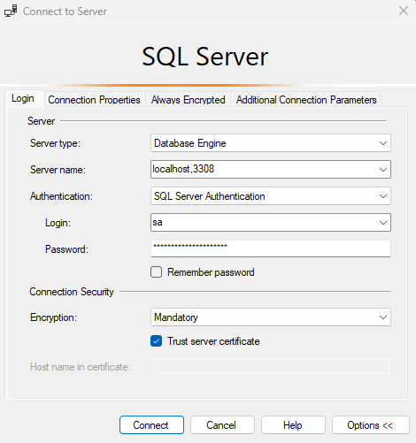
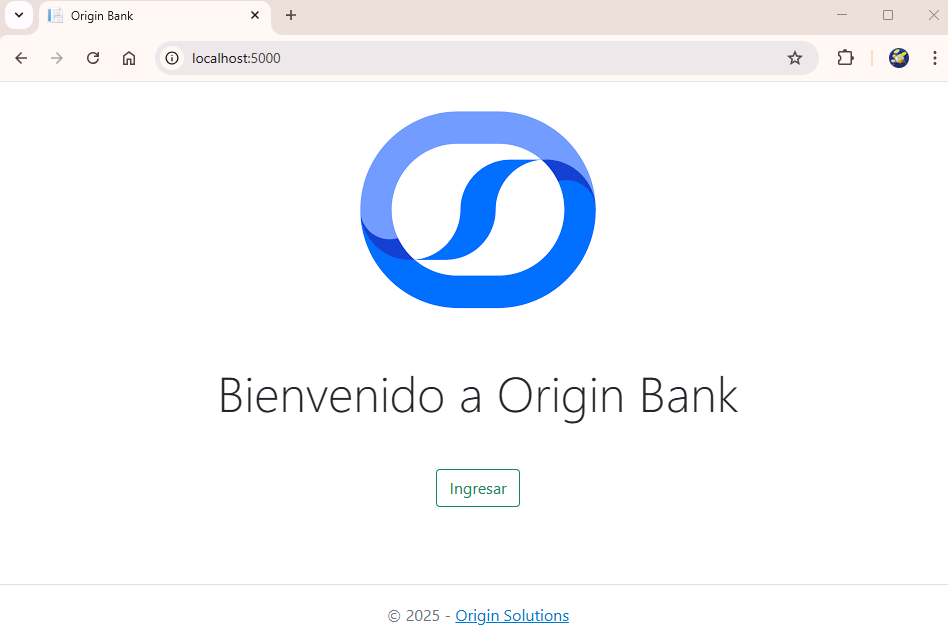
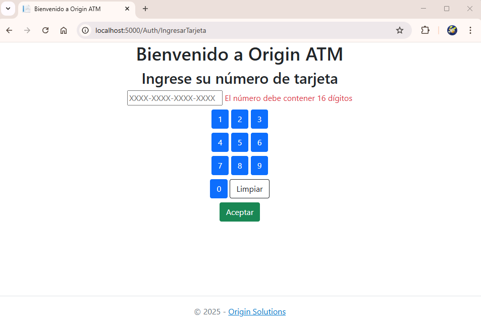
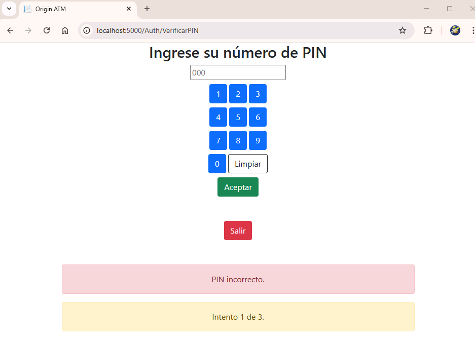
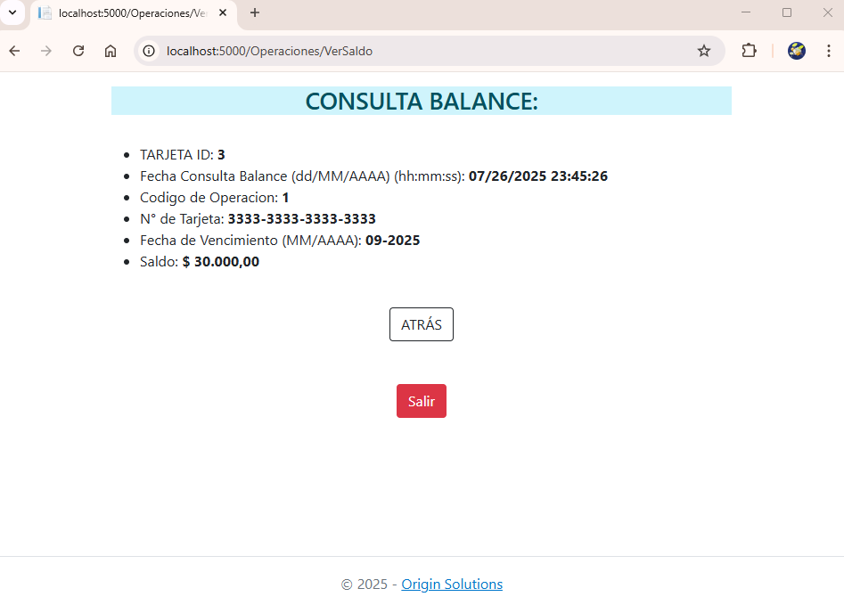
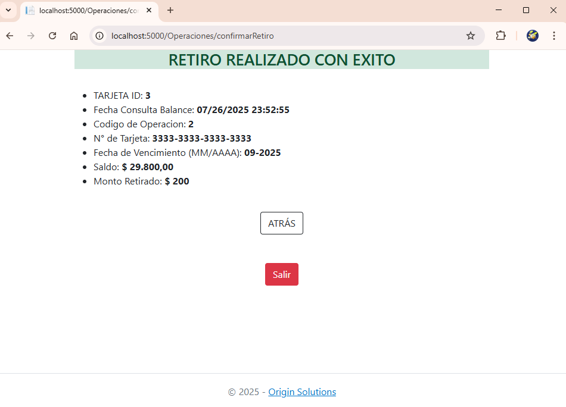

# 🏧 OriginATM — Simulador de Cajero Automático

OriginATM es una aplicación web desarrollada con .NET 8 y MVC que simula el comportamiento de un cajero automático. Permite a los usuarios autenticarse con su número de tarjeta y PIN, consultar el saldo y realizar retiros.

---

## ✨ Funcionalidades

- 🔐 Inicio de sesión con número de tarjeta + PIN
- 💰 Consulta de saldo disponible
- 💳 Retiros con validación de fondos
- 🧾 Registro de operaciones
- 🐳 Deploy automático vía Docker Compose

---

## 🛠️ Tecnologías Utilizadas

- ASP.NET Core MVC (.NET 8)
- Entity Framework Core
- SQL Server 2022
- Docker y Docker Compose
- C#
- Bootstrap (UI simple)
- JavaScript
- HTML5
- CSS3

---

## 🧱 Arquitectura del Proyecto

El proyecto sigue una estructura por capas con separación de responsabilidades:

- `OriginATM.Web`: Proyecto principal MVC
- `OriginATM.Dominio`: Entidades y enums.
- `OriginATM.Repository`: Implementaciones de Patrón Repository.
- `OriginATM.Infraestructura`: DbContext y configuración de Entity Framework.

---
⚠️ Consideraciones importantes antes de ejecutar la aplicación
Antes de ejecutar docker-compose up --build, asegurate de que no haya ningún servicio corriendo en los siguientes puertos de tu máquina local:
| Servicio       | Puerto local | 
| -------------- | ------------ | 
| SQL Server     | `3308`       | 
| Aplicación Web | `5000`       | 


## 🚀 ¿Cómo correr la aplicación?

> ⚠️ Requisitos: Docker Desktop

```bash
git clone https://github.com/storreglosa-code/OriginATM.git
cd OriginATM
docker-compose up --build
```
Y se accede desde: http://localhost:5000

## 📝 Datos de prueba
| Número de Tarjeta | PIN | Saldo (\$) | ¿Bloqueada? | Intentos Fallidos | Vencimiento |
| ----------------- | --- | ---------- | ----------- | ----------------- | ----------- |
| 1111111111111111  | 111 | 1.234      | ❌ No       |     2             | Ago 2025    |
| 2222222222222222  | 222 | 23.000     | ❌ No       |     1             | Ago 2027    |
| 3333333333333333  | 333 | 30.000     | ❌ No       |     0             | Sep 2025    |
| 4444444444444444  | 444 | 44.444     | ❌ No       |     1             | Oct 2025    |
| 5555555555555555  | 555 | 50.999     | ✅ Sí       |     4             | Dic 2025    |

## 🗄️ Acceder a la base de datos desde SQL Server Management Studio (SSMS)
Si deseás inspeccionar o modificar los datos directamente desde SSMS (u otra herramienta cliente compatible con SQL Server), podés conectarte al contenedor Docker utilizando las siguientes credenciales:

- Server name: localhost,3308
- Authentication: SQL Server Authentication
- Login: sa
- Password: Your_strong_password1
- Trust Server Certificate: ✔️ (checked)

📸 Captura de ejemplo:



⚠️ Asegurate de que el contenedor de SQL Server esté en ejecución (docker ps) y que el puerto 3308 no esté ocupado por otra aplicación.


## ⚠️ Nota sobre la zona horaria
Las operaciones registradas en la base de datos pueden mostrar una diferencia horaria con respecto a la hora local (UTC-3). Esto se debe a que el contenedor de SQL Server corre en zona horaria UTC por defecto. No afecta el funcionamiento de la aplicación.


## 🖼️ Capturas de la Aplicación

### Pantalla de Inicio



### Validación Datos (Numero de Tarjeta y Pin)




### Operación de Balance



### Operación de extracción

